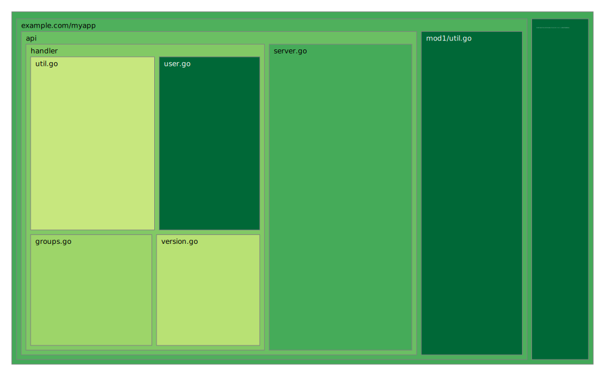

# go-integration-tests-sample

## prerequisite

```
$ go install github.com/nikolaydubina/go-cover-treemap@latest
```

## how to test and confirm coverage data

### go test with -cover only

```
$ make cover
```

confirm coverage.html and treemap.svg

### go test -cover with -coverpkg

```
$ make coverpkg
```

confirm coverage.html and treemap.svg

### go build with -cover

read [Code coverage for Go integration tests](https://go.dev/blog/integration-test-coverage), then try it.

```
$ make bin/covapi
$ GOCOVERDIR="$PWD/covdir" ./bin/covapi
```

confirm covdir to store coverage data.

```
$ ls -l covdir
$ curl localhost:8081/version
$ curl localhost:8081/groups
```

request users handler some times to get both normal and error responses.

```
$ curl localhost:8081/users
$ curl localhost:8081/users
$ curl localhost:8081/users
$ curl localhost:8081/users
$ curl localhost:8081/users
```

stop covapi binary with ctrl+c.

confirm covdir to store coverage data.

```
$ ls -l covdir
```

### go test -cover and -coverpkg with -test.gocoverdir

```
$ make itcoverage
```

confirm covdir to store coverage data.

```
$ ls -l covdir
```

confirm coverage.html and treemap.svg

* [example/coverage.html](https://html-preview.github.io/?url=https://github.com/t2y/go-integration-tests-sample/blob/main/example/coverage.html)


